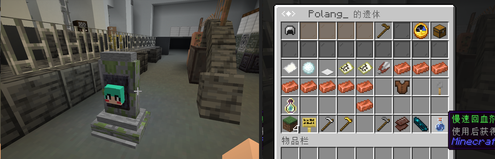
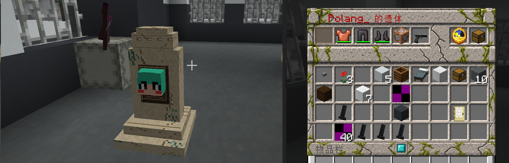

  

# TracesDeath

[简体中文](README.md) · English

**A lightweight Minecraft corpse plugin. Recover your items and experience from your remains, then leave nothing behind.**

Player corpses with skins and equipment, and stone tombstones with the player's head, work without a resource pack. The optional pack adds warm sandstone tombstones and a mossy stone inventory frame.

[Architecture](docs/ARCHITECTURE.md) · [Feature checklist](docs/FEATURES.md) · [Entity and texture settings](docs/ENTITY_TYPES.md) (Chinese)

## Download

[GitHub Releases](https://github.com/polang233/TracesDeath/releases/latest) provides the plugin JAR and the optional `TracesDeath.zip` resource pack.

## In game

**Player corpse · No resource pack needed**

  

**Without the pack: a stone tombstone and the standard menu**

  

**With the pack: sandstone textures and a mossy stone menu**

  

## Features

- Three appearances: a player model, a tombstone, or a chest minecart for older servers.
- Separate equipment slots. Click, Shift-click, or collect everything; restore original slots or fill available inventory space.
- Death details and saved experience. Keep 50% of experience by default, choose another percentage, or collect it separately.
- Respects keep-inventory deaths. Exclude special items by their display name or lore for use with binding plugins.
- Editable Chinese and English language files, with configuration reload support.
- Saved corpse records survive restarts. The display disappears when all items and experience have been collected.

## Get started

**Minecraft 1.20+ is recommended.** Place the JAR in your server's `plugins` folder and restart. Chest minecarts support Bukkit/Spigot/Paper 1.12+, tombstones require Paper 1.19.4+, and player models require Paper 1.21.9+. Use the Java version required by your server.

Choose `auto`, `mannequin`, `tombstone`, or `chest_minecart` under `corpse.type` in `config.yml`. `auto` uses a player model when available, otherwise a chest minecart. Selecting `tombstone` and running `/td reload` creates `tombstone.yml` and exports the bundled pack to `plugins/TracesDeath/resource-packs/`.

The optional pack requires a 1.20+ client. Place the ZIP in `.minecraft/resourcepacks/` and enable it in game.

Set `language: en_US` in `config.yml` for English. Edit `languages/en_US.yml` to change messages, then run `/td reload`. Chinese (`zh_CN`) is the default.

Set `experience.keep-percent` from 0 to 100; the default is 50. Zero leaves experience to the server's existing death rules. Click **Collect all** to take items and experience, or hover over it and press **Q** to take only experience. Taking the final item also awards any experience left in the corpse.

Use `death.exclude-items.name-contains` and `lore-contains` to exclude bound items. Matching ignores color codes and letter case. Excluded items are left to normal death drops or the binding plugin; TracesDeath does not return them to the player.

Commands: `/td list` lists corpses, `/td locate` shows your corpse locations. Administrators can use `/td reload` to reload settings and language, and `/td testpack [player]` to send the bundled pack for testing. Replacing the plugin JAR requires a server restart.

## Support

- [GitHub Issues: bugs and suggestions](https://github.com/polang233/TracesDeath/issues)
- QQ group: **620224543** (Chinese)

If you find TracesDeath useful, a ⭐ Star is appreciated!

## Usage statistics

