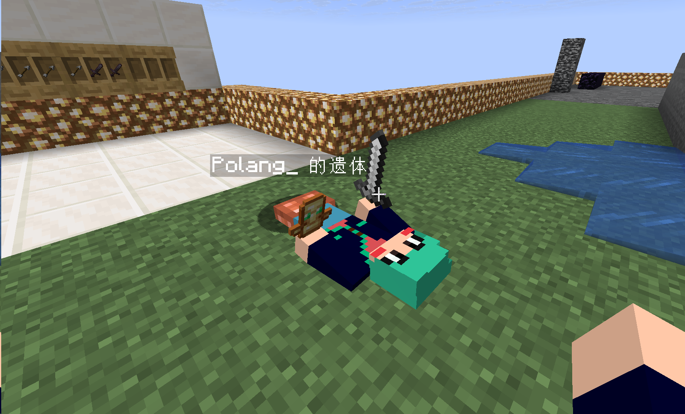
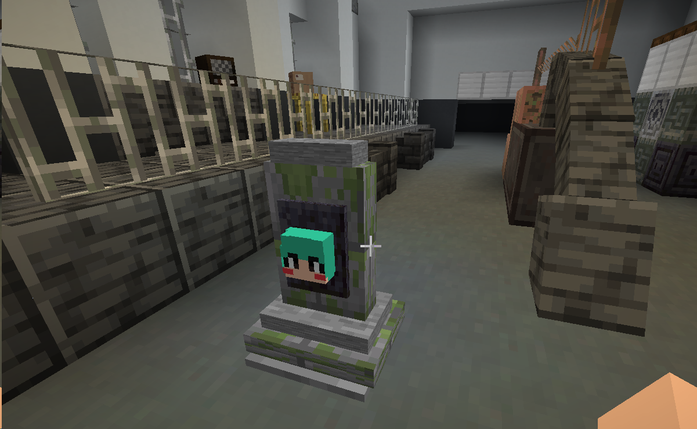
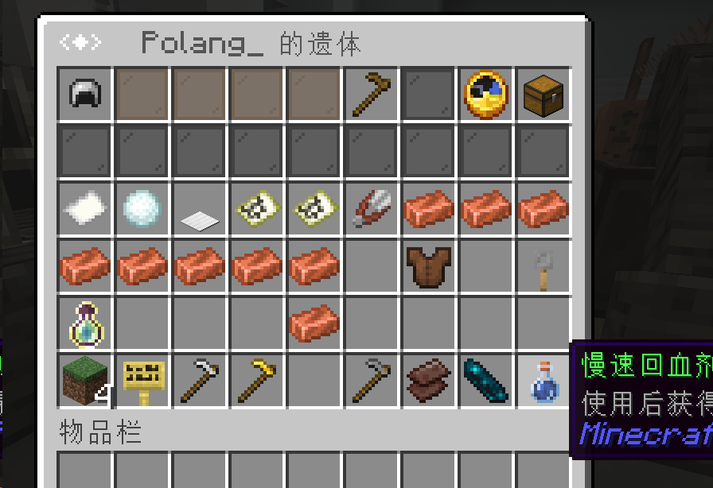
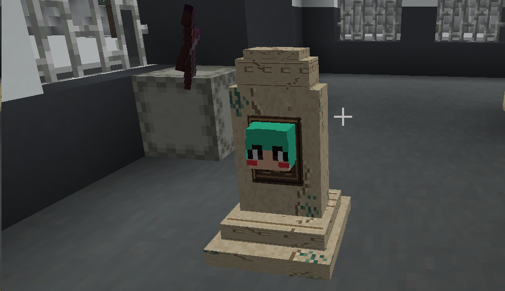
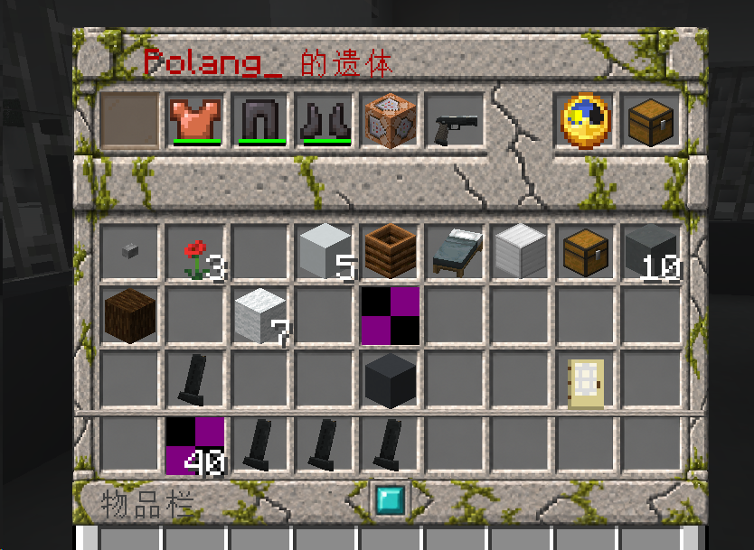

  

# TracesDeath

**轻量 Minecraft 遗体插件：死亡留下遗体，右键取回物品，取空后自动消失。**

无需资源包即可显示带皮肤与装备的玩家遗体，或带死者头颅的组合墓碑。安装可选资源包后，墓碑获得专用纹理，遗体 GUI 显示苔石边框与装饰。

[核心设计](docs/ARCHITECTURE.md) · [功能清单](docs/FEATURES.md) · [实体与材质配置](docs/ENTITY_TYPES.md)

## 下载

Release 提供插件 JAR 与可选资源包 `TracesDeath.zip`。

## 效果展示

**玩家遗体 · 无需资源包**

  

**不加载资源包：组合墓碑与原版界面**

  
  

**加载资源包：专用墓碑材质与 GUI 装饰**

  
  

## 核心功能

- 玩家模型、组合墓碑、兼容旧版本的箱子矿车三种外观。
- 装备与主手独立展示，支持点击、Shift 和一键拾取，按配置恢复原槽位或收入背包。
- 显示死亡者、死亡时间、死亡位置及剩余物品格数。
- 保存遗体记录，支持重启恢复，取空后清理全部展示部件。

## 开始使用

推荐使用 **1.20+**。将 JAR 放入服务端 `plugins` 后重启。箱子矿车支持 Bukkit/Spigot/Paper 1.12+，墓碑要求 Paper 1.19.4+，玩家模型要求 Paper 1.21.9+；Java 版本遵循所用服务端要求。

在 `config.yml` 的 `corpse.type` 选择 `auto`、`mannequin`、`tombstone` 或 `chest_minecart`。`auto` 优先使用可用的玩家模型。选择墓碑并执行 `/td reload` 后，自动生成 `tombstone.yml`，同时导出组合资源包到 `plugins/TracesDeath/resource-packs/`。

资源包适用于 1.20+ 客户端：将 ZIP 放入 `.minecraft/resourcepacks/`，在游戏设置中启用即可。玩家可自由选择是否安装。

常用命令：`/td list` 查看遗体，`/td locate` 查看位置，管理员用 `/td reload` 重载配置、`/td testpack [玩家]` 手动测试资源包。替换插件 JAR 后需要重启。

---

## 支持与反馈

由 **Polang** 开发，采用 [GNU GPLv3](LICENSE) 开源。第三方组件声明见 [Third-party notices](THIRD_PARTY_NOTICES.md)。[提交问题或建议](https://github.com/polang233/TracesDeath/issues) 时，请附上服务端版本、插件版本及相关日志。

**如果觉得好用，欢迎点个 ⭐ Star 支持一下！**

[SpigotMC 英文介绍（BBCode）](docs/publishing/SPIGOT.en.bbcode.txt) · [论坛介绍（Markdown）](docs/publishing/FORUM.zh-CN.md)

## 使用统计

默认启用 bStats 基础统计，遵循服务端 bStats 全局设置。

